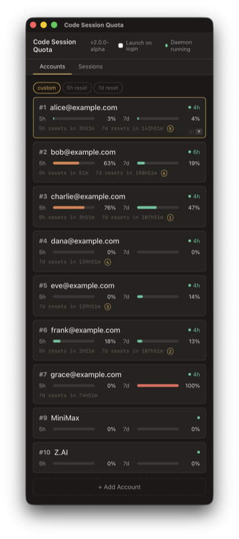

# Code Session Quota (csq)

Multi-provider session manager for Claude Code. Run Claude Code against local models (Ollama), third-party APIs (MiniMax, Z.AI), or pool multiple Claude Max subscriptions -- all with per-terminal isolation, shared history, a desktop dashboard, and a statusline.

<table>
<tr>
<td></td>
<td></td>
</tr>
</table>

## What it does

- **Desktop dashboard** -- see all accounts, quota bars, token health, and reset times at a glance. Sort by custom order, 5h reset, or 7d reset. Ranked badges show which accounts to use first.
- **Any model provider** -- `csq run 1 -p ollama` runs CC against a local Qwen/Gemma model. `csq run 2 -p mm` routes through MiniMax. `csq run 3` uses your Claude Max subscription.
- **Per-terminal isolation** -- each terminal gets its own `CLAUDE_CONFIG_DIR` and keychain slot. Swapping one terminal doesn't affect others. 15+ concurrent terminals work without contention.
- **Shared history & memory** -- conversations, projects, and auto-memory are symlinked from `~/.claude`, so `/resume` works across all accounts and providers.
- **Background daemon** -- auto-refreshes OAuth tokens and polls Anthropic for usage data. No manual token management after initial login.
- **In-place account swap** -- `! csq swap N` from inside CC switches credentials without restarting the conversation.
- **Context & cost in statusline** -- see `csq #5:alice 5h:42% | ctx:241k 24% | $5.39` at a glance.
- **System tray** -- tray icon with per-account quick-swap menu. Icon color reflects health (green/yellow/red).
- **Cross-platform** -- macOS, Linux, and Windows. Tested in CI on all three.

## Install

### From source (recommended for developers)

```bash
git clone https://github.com/terrene-foundation/csq.git
cd csq
cargo install --path csq-cli
```

### Shell installer (non-developers)

```bash
curl -sSL https://raw.githubusercontent.com/terrene-foundation/csq/main/install.sh | bash
```

Or clone and run locally:

```bash
git clone https://github.com/terrene-foundation/csq.git
cd csq
bash install.sh
```

The installer auto-detects your platform (macOS / Linux / WSL / Git Bash) and configures credential storage.

### Desktop app

```bash
cd csq-desktop
npm install
npm run tauri build
```

The built app is in `csq-desktop/src-tauri/target/release/bundle/`. For development: `npm run tauri dev`.

## Using local models (Ollama)

Run Claude Code against any model in Ollama -- no API key needed, no rate limits, fully local.

### Prerequisites

Install [Ollama](https://ollama.com) and pull a model:

```bash
ollama pull gemma4           # 9.6 GB -- recommended: fast, COC-compliant
ollama pull qwen3.5          # 6.6 GB -- capable but slow on local hardware
```

Claude Code requires a large context window. Recommended: **256k tokens** (set via Ollama's `num_ctx` parameter or model defaults).

### Setup (one-time)

```bash
csq setkey ollama            # creates the Ollama profile (no key needed)
```

This creates `~/.claude/settings-ollama.json` with:

```json
{
  "env": {
    "ANTHROPIC_BASE_URL": "http://localhost:11434",
    "ANTHROPIC_AUTH_TOKEN": "ollama",
    "ANTHROPIC_API_KEY": "",
    "ANTHROPIC_MODEL": "qwen3:latest",
    "ANTHROPIC_SMALL_FAST_MODEL": "qwen3:latest",
    "ANTHROPIC_DEFAULT_SONNET_MODEL": "qwen3:latest",
    "ANTHROPIC_DEFAULT_OPUS_MODEL": "qwen3:latest",
    "ANTHROPIC_DEFAULT_HAIKU_MODEL": "qwen3:latest",
    "API_TIMEOUT_MS": "3000000",
    "CLAUDE_CODE_DISABLE_NONESSENTIAL_TRAFFIC": "1"
  }
}
```

To change the model: `csq models ollama <model-name>` (or edit `~/.claude/settings-ollama.json` manually).

### Run

```bash
csq run 1 -p ollama          # start CC on account 1, routed through Ollama
```

See [Ollama's Claude Code integration docs](https://docs.ollama.com/integrations/claude-code) for more options.

## Using third-party APIs (MiniMax, Z.AI)

### MiniMax (M2.7)

```bash
csq setkey mm                # prompts for your MiniMax API key (hidden input)
```

Creates `~/.claude/settings-mm.json` with:

| Setting              | Value                              |
| -------------------- | ---------------------------------- |
| `ANTHROPIC_BASE_URL` | `https://api.minimax.io/anthropic` |
| `ANTHROPIC_MODEL`    | `MiniMax-M2.7-highspeed`           |
| All model aliases    | `MiniMax-M2.7-highspeed`           |

```bash
csq run 1 -p mm              # start CC routed through MiniMax
```

### Z.AI (GLM-5.1)

```bash
csq setkey zai               # prompts for your Z.AI API key (hidden input)
```

Creates `~/.claude/settings-zai.json` with:

| Setting              | Value                            |
| -------------------- | -------------------------------- |
| `ANTHROPIC_BASE_URL` | `https://api.z.ai/api/anthropic` |
| `ANTHROPIC_MODEL`    | `glm-5.1`                        |
| All model aliases    | `glm-5.1`                        |

```bash
csq run 1 -p zai             # start CC routed through Z.AI
```

### Claude direct API key

If you have a direct Anthropic API key (not OAuth/Max subscription):

```bash
csq setkey claude            # prompts for your API key
csq run 1 -p claude          # uses ANTHROPIC_API_KEY auth instead of OAuth
```

### How profiles work

Profiles are JSON files at `~/.claude/settings-<name>.json` that get deep-merged onto your default `~/.claude/settings.json` at terminal start. `csq setkey` creates and manages these files. You can edit them manually to change model names, timeouts, or add other settings.

When you run `csq run 5 -p mm`, csq:

1. Reads `~/.claude/settings.json` (your full default -- hooks, statusline, plugins, etc.)
2. Reads `~/.claude/settings-mm.json` (the overlay)
3. Deep-merges them (overlay keys win; your default hooks/statusline/plugins carry through)
4. Writes the result to `config-5/settings.json` for that terminal only

Your default settings are never modified. Each terminal gets a fresh settings snapshot.

### Managing profiles

```bash
csq listkeys                 # show configured providers with masked key fingerprints
csq rmkey zai                # remove a profile entirely
```

### Model management

```bash
csq models                   # show all profiles + current models
csq models zai               # list available models for Z.AI
csq models zai glm-4.7       # switch zai to a different model
csq models ollama            # list locally installed ollama models
```

When a newer model is available, `csq models` shows an update indicator:

```
Profile      Model                          Status
zai          glm-4.7                        (update: glm-5.1)
mm           MiniMax-M2.7-highspeed         (latest)
```

The model catalog updates automatically -- csq auto-updates from GitHub on every `csq run` (silently, in the background, with a 3s timeout for offline safety).

## Model benchmarks

csq routes Claude Code to any provider -- but which models actually work well? We ship benchmark harnesses that test model performance under real workloads.

### Which model should I use?

| Model               | Provider | Runs  |   Speed   | Cooperative (/50) | Adversarial (/50) | Total (/100) |
| ------------------- | -------- | ----- | :-------: | :---------------: | :---------------: | :----------: |
| **Claude Opus 4.6** | default  | 5-run | 13s/task  |       50.0        |       43.0        |   **93.0**   |
| **Z.AI GLM-5.1**    | zai      | 5-run | 46s/task  |       49.0        |       36.8        |   **85.8**   |
| **MiniMax M2.7**    | mm       | 5-run | 14s/task  |       49.6        |       21.0        |   **70.6**   |
| **gemma4**          | ollama   | 1-run | 165s/task |        45         |        10         |    **55**    |
| **qwen3.5**         | ollama   | 1-run | 175s/task |        25         |        26         |    **51**    |

**What this means for choosing a provider:**

- **Claude Opus** is the clear leader -- near-perfect rule adherence and the only model that consistently refuses adversarial prompts. Use this when quality matters.
- **GLM-5.1** is the strongest non-Claude model (85.8). Good for cost-sensitive workloads where you can review outputs.
- **MiniMax M2.7** is fast (14s/task, comparable to Claude) but weak on adversarial tests. Use for speed when you're actively supervising.
- **gemma4** (local, free) completes everything but rarely enforces rules under pressure. Good for experimentation and offline work.
- **qwen3.5** (local, free) is too slow for practical use on most hardware (175s/task, 50% timeout rate).

## Multi-account rotation (Claude Max)

Pool multiple Claude Max subscriptions for uninterrupted sessions. When one account hits a rate limit, swap to another.

### The problem

Claude Max has rolling rate limits (5-hour and 7-day windows). Heavy users hit these regularly. Manually switching with `/login` interrupts flow and requires guessing which account has capacity.

### Setup (one-time per account)

```bash
csq login 1   # opens browser, log in to account 1, saves creds
csq login 2   # repeat for each account
csq login 3
# ...as many as you need
```

### Daily use

```bash
csq run 1                    # terminal 1 on account 1
csq run 3                    # terminal 2 on account 3
csq run 5                    # terminal 3 on account 5
```

If you have only one account, `csq` (no number) auto-resolves. With zero accounts, `csq` is invisible -- just runs vanilla `claude`.

Any extra arguments pass through to `claude`:

```bash
csq run 5 --resume           # resume the most recent conversation
csq run 5 --resume <id>      # resume a specific session
csq run 3 -p "summarize X"   # one-shot prompt
```

### When rate limited

Inside the rate-limited CC session, type:

```
!csq swap 3       # swap THIS terminal to account 3
```

The `!` prefix runs the command as a local shell op -- works even when CC is rate-limited. The next message you send uses account 3's token, in the same conversation, no restart.

If you want to know which account to swap to:

```
!csq suggest      # shows the account with most capacity
```

### Quick start (single account)

```bash
csq              # equivalent to vanilla `claude` -- csq stays out of your way
csq --resume     # passes flags straight through
```

## Desktop app

The desktop app provides a live dashboard for managing accounts and sessions. It runs an in-process daemon that handles token refresh, usage polling, and credential fanout -- no separate process needed.

<table>
<tr>
<td width="50%">

**Accounts tab**

- Quota bars (5h and 7d) with color coding
- Token health badges (healthy/expiring/expired)
- Reset countdowns with ranked badges (1, 2, 3...)
- Sort by custom order, 5h reset, or 7d reset
- Maxed-out accounts excluded from rankings
- Re-auth button on expired accounts
- Double-click to rename any account

</td>
<td width="50%">

**Sessions tab**

- Every running `claude` process appears automatically
- Account labels update in real-time after renames
- Quota per session at a glance
- Sort by custom order, title, or account
- Click "Swap" to change any session's account
- "Restart needed" badge for stale sessions
- Double-click to give sessions custom names

</td>
</tr>
</table>

**System tray**: icon with per-account quick-swap menu. Icon color reflects health. "Launch on login" toggle for auto-start.

## Command reference

```bash
# Session management
csq run N [-p provider]      # start CC on account N, optional provider profile
csq run N --resume           # resume most recent conversation on account N
csq swap N                   # in-place swap THIS terminal to account N
csq status                   # show all accounts with quota and reset times
csq suggest                  # suggest which account to swap to
csq statusline               # compact status for shell prompt integration

# Account management
csq login N                  # save account N's credentials (opens browser)
csq repair-credentials       # fix cross-slot credential contamination

# Provider profiles
csq setkey <provider> [key]  # add/update provider API key
csq listkeys                 # show configured providers with masked keys
csq rmkey <provider>         # remove a provider profile
csq models                   # show all profiles + current models
csq models <provider> <name> # switch a provider to a different model

# System
csq daemon start             # start background daemon
csq daemon stop              # stop background daemon
csq daemon status            # check daemon health
csq doctor                   # run diagnostics and report system health
csq install                  # install csq into ~/.claude (create dirs, patch settings)
csq update                   # check for newer releases on GitHub
```

## How it works

### Per-terminal isolation

Claude Code uses `CLAUDE_CONFIG_DIR` to determine which keychain entry to read/write. Each config directory gets a unique keychain slot.

```
csq run 3
  -> CLAUDE_CONFIG_DIR=~/.claude/accounts/config-3
  -> isolated credentials, settings, identity
  -> shared history, projects, memory (symlinked from ~/.claude)
```

### Shared artifacts

Only credentials, account identity, and `settings.json` stay isolated. Everything else in `~/.claude` (projects, sessions, history, plugins, commands, agents, skills, memory) is symlinked into each `config-N/` on every `csq run`. So all terminals see the same conversations, the same `/resume` list, and the same auto-memory.

### Background daemon

The daemon runs in-process inside the desktop app (or standalone via `csq daemon start`) and handles:

- **Token refresh** -- checks every 5 minutes, refreshes tokens expiring within 2 hours
- **Usage polling** -- polls Anthropic's `/api/oauth/usage` for each account's real quota
- **Credential fanout** -- distributes refreshed tokens to all terminals using that account
- **IPC server** -- Unix socket for CLI and desktop communication

### Account/terminal separation

- **Account** = an authenticated Anthropic identity with its own credentials and quota
- **Terminal** = a CC instance that borrows an account's credentials
- Quota comes from Anthropic's API (polled by the daemon), not from individual terminals
- The `.csq-account` marker file in each config dir is the source of truth for identity

### Credential storage

- **macOS**: per-config-dir keychain entry via `security-framework` with file fallback
- **Linux / WSL / Windows**: file-only (`.credentials.json` in the per-config-dir)
- All credential files written atomically (temp + rename) with `0600` permissions

## Architecture

csq is a Rust workspace with three crates:

| Crate         | Purpose                                                             |
| ------------- | ------------------------------------------------------------------- |
| `csq-core`    | OAuth, credentials, quota, daemon, session discovery, rotation      |
| `csq-cli`     | CLI binary (`csq run`, `csq login`, `csq status`, `csq swap`, etc.) |
| `csq-desktop` | Tauri 2.x desktop app with Svelte 5 frontend                        |

### Files

| Path                                       | Purpose                                  |
| ------------------------------------------ | ---------------------------------------- |
| `~/.claude/accounts/credentials/N.json`    | OAuth credentials per account (mode 600) |
| `~/.claude/accounts/profiles.json`         | Account labels and email mappings        |
| `~/.claude/accounts/quota.json`            | Per-account quota from Anthropic API     |
| `~/.claude/accounts/config-N/`             | Per-terminal CC config directory         |
| `~/.claude/accounts/config-N/.csq-account` | Account identity marker                  |
| `~/.claude/settings-<provider>.json`       | Provider profile overlays                |

### Platform support

| Platform | CLI  | Desktop | Daemon         | Session discovery     |
| -------- | ---- | ------- | -------------- | --------------------- |
| macOS    | Full | Full    | Full           | Full (ps + osascript) |
| Linux    | Full | Full    | Full           | Full (/proc)          |
| Windows  | Full | Full    | Planned (M8.6) | Full (PEB walking)    |

## Use in VS Code

The VS Code Claude Code extension reads the same `~/.claude/settings.json` that csq writes, so the statusline and `! csq swap N` both work in VS Code's Claude Code panel. The core swap functionality (`! csq swap N`) is a shell command and works regardless of hook reliability.

No VS Code extension or plugin is needed. Install csq once via the regular installer; VS Code picks it up automatically.

## Troubleshooting

**Statusline not showing** -- check that `~/.claude/accounts/statusline-quota.sh` exists and that your `~/.claude/settings.json` has `"statusLine": {"type":"command","command":"bash ~/.claude/accounts/statusline-quota.sh"}`. Run `csq doctor` for diagnostics.

**`csq swap` says swap succeeded but CC shows "rate limited"** -- the access token may be stuck on Anthropic's side. Run `csq login N` to capture a fresh token via a full OAuth flow.

**Desktop app shows "restart needed"** -- this means credentials were swapped after that CC session started. CC caches credentials in memory, so you need to `/exit` and relaunch that session for the swap to take effect.

**Wrong model after swap** -- check `~/.claude/accounts/config-N/.claude.json` for a `cachedGrowthBookFeatures.tengu_auto_mode_config` flag. Anthropic's A/B testing can silently override model selection. Delete the cache entry to fix.

**Symlinks fail on Windows** -- csq uses directory junctions (`mklink /J`) on Windows, which don't need admin privileges. If junction creation fails, csq falls back to copying.

## Uninstall

```bash
rm -rf ~/.claude/accounts
rm ~/.local/bin/csq          # or ~/bin/csq
# Remove statusLine and hooks from ~/.claude/settings.json
```

**Windows**: remove directory junctions inside `config-N/` before deleting:

```bash
for d in ~/.claude/accounts/config-*/; do
    for item in "$d"*; do
        [ -L "$item" ] && rm "$item"
    done
done
rm -rf ~/.claude/accounts
```

## Development

```bash
cargo test --workspace              # 594 Rust tests
cargo clippy --workspace --all-targets -- -D warnings
cargo fmt --all
cd csq-desktop && npm run tauri dev # desktop dev mode
cd csq-desktop && npx vitest run    # Svelte tests
```

## License

Apache 2.0 -- [Terrene Foundation](https://terrene.foundation)
